# Running a sample Spring Boot Java application with OpenTelemetry​

The sample Spring Boot Java application will have three microservices and a service registry

    - user-service
    - orders-service
    - payment-service
    - discovery-service (eureka server - service registry)

Here’s the architecture of the sample Java application along with OpenTelemetry and SigNoz.

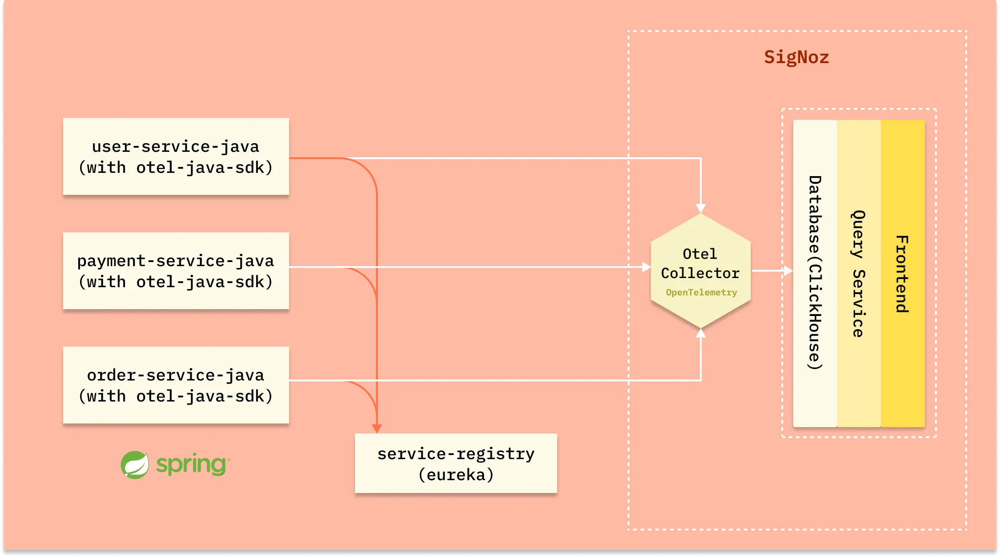

## Pre-requisites​

- Java 8 or newer
- MySql 8
- SigNoz
- Maven

## Installing SigNoz​

SigNoz can be installed on macOS or Linux computers in just three steps by using a simple install script.

The install script automatically installs [Docker Engine](https://docs.docker.com/engine/install/) on Linux. However, on macOS, you must manually install Docker Engine before running the install script.

```
git clone -b main https://github.com/SigNoz/signoz.git
cd signoz/deploy/
./install.sh
```

When you are done installing SigNoz, you can access the UI at http://localhost:3301

SigNoz dashboard - It shows services from a sample app that comes bundled with the application

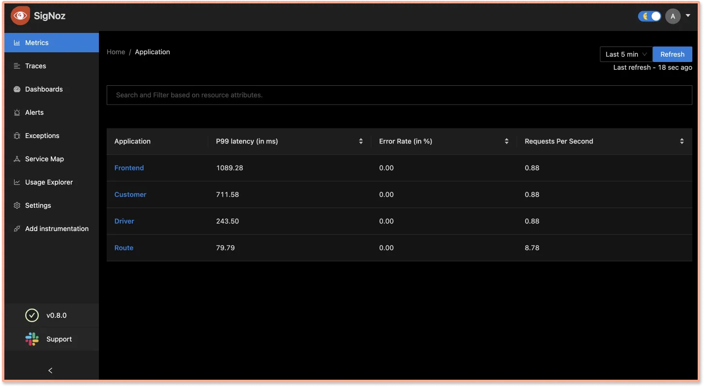

## Installing MySql​

Download MySQL community version from [here](https://dev.mysql.com/downloads/mysql/) based on your operating system.

Once installation is complete, run the below commands to create a database for our sample java app.

```
➜  ~ mysql -u root
mysql> create database signoz;
mysql> use signoz;
```

## Installing Maven​

To install maven follow below steps:

```
cd ~
mkdir maven
cd maven
curl -L https://dlcdn.apache.org/maven/maven-3/3.8.4/binaries/apache-maven-3.8.4-bin.zip -o maven.zip
unzip maven.zip
echo -n '\n export PATH=~/maven/apache-maven-3.8.4/bin:$PATH' >> ~/.zshrc
source ~/.zshrc
```

Verify maven using below command ```mvn -version```

## Running sample application​

Below are the steps to run the sample Java application with OpenTelemetry:

1. Run service discovery with Eureka Server

```
cd discovery-server
mvn clean install -Dmaven.test.skip
docker build -t discovery-service:1.0.1 .
docker run -d --name discovery-service -p 8761:8761 discovery-service:1.0.1
```

You can go to http://localhost:8761/ and make sure your discover service registry with Eureka server is up and running.

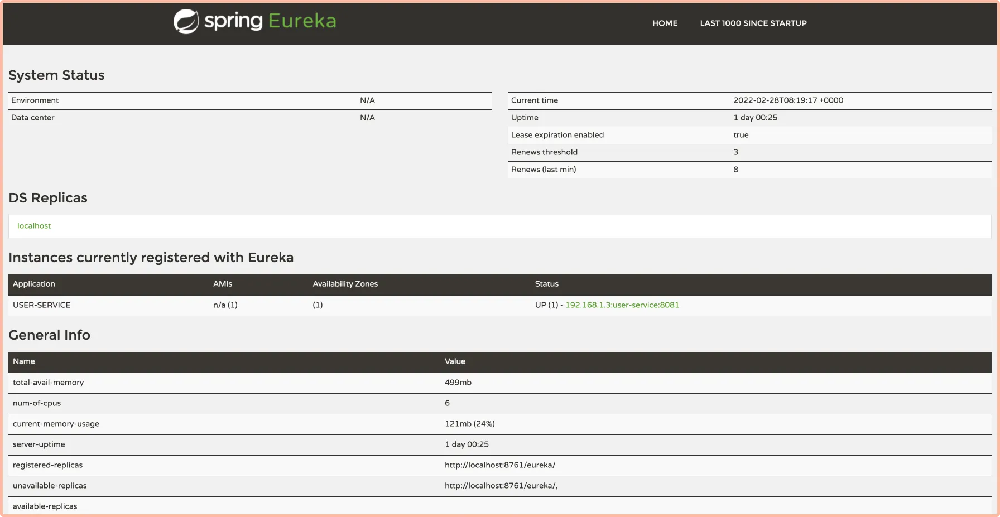

2. Setting up Opentelemetry agent

For instrumenting Java applications, OpenTelemetry has a very handy Java JAR agent that can be attached to any Java 8+ application. The JAR agent can detect a number of [popular libraries and frameworks](https://github.com/open-telemetry/opentelemetry-java-instrumentation/blob/main/docs/supported-libraries.md) and instrument it right out of the box. You don't need to add any code for that.

Download the [latest version](https://github.com/open-telemetry/opentelemetry-java-instrumentation/releases/latest/download/opentelemetry-javaagent.jar) of the Java JAR agent, and copy jar agent file in your application code. We have placed the agent under the folder named ```agents```.

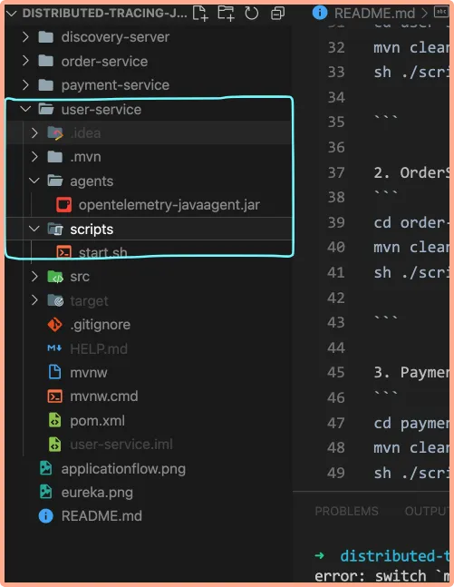

Placed OpenTelemetry Java Jar agent under a folder named agents

3. Setting up SigNoz as the OpenTelemetry backend

To set up OpenTelemetry to collect and export telemetry data, you need to specify OTLP (OpenTelemetry Protocol) endpoint. It consists of the IP of the machine where SigNoz is installed and the port number at which SigNoz listens. OTLP endpoint for SigNoz - ```<IP of the machine>:4317```

If you have installed SigNoz on your local machine, then your endpoint is ```127.0.0.1:4317```.

Create a [start.sh](https://github.com/mounirdevelopment/distributed-tracing-java-sample-opentelemetry/main/user-service/blob/main/user-service/scripts/start.sh) script with below environment variables and move it to scripts folder. Notice that we have updated the OTLP endpoint under ```-Dotel.exporter.otlp.traces.endpoint=http://localhost:4317```.

```
JAVA_OPTS="${JAVA_OPTS} \
-Xms${JAVA_XMS} \
-Xmx${JAVA_XMX} \
-Dapplication.name=user-service-java \
-Dotel.traces.exporter=otlp \
-Dotel.resource.attributes=service.name=user-service-java \
-Dotel.exporter.otlp.traces.endpoint=http://localhost:4317 \
-Dotel.service.name=user-service-java \
-Dotel.javaagent.debug=false \
-javaagent:../agents/opentelemetry-javaagent.jar"
```

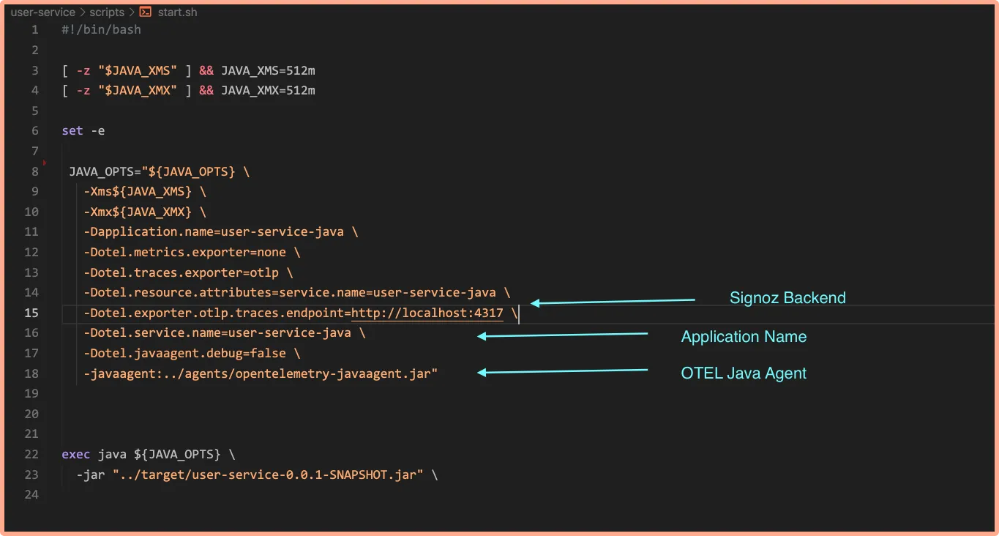

Code in scripts file

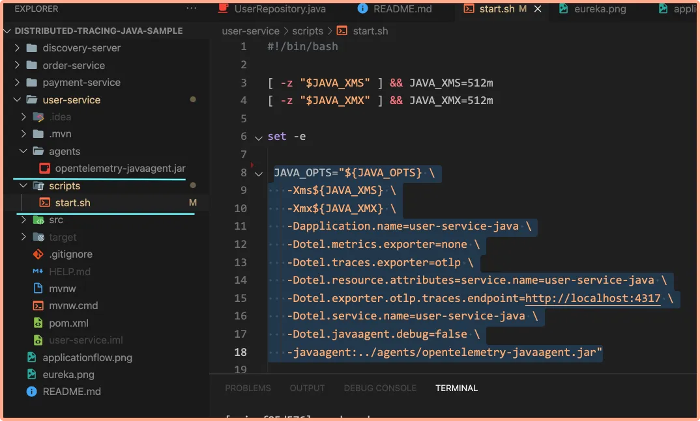

Scritps.sh file under scripts folder

4. Run the microservices

Now you need to run your microservices. ```Run users-service```:

```
cd user-service
mvn clean install -Dmaven.test.skip # Build user-service jar
cd scripts
sh ./start.sh # Run user-service with OTEL java agent
```

Open a new tab of your terminal, and run ```payment-service```:

```
cd payment-service
mvn clean install -Dmaven.test.skip
cd scripts
sh ./start.sh
```

Open a new tab of your terminal, and run ```order-service```:

```
cd order-service
mvn clean install -Dmaven.test.skip
cd scripts
sh ./start.sh
```

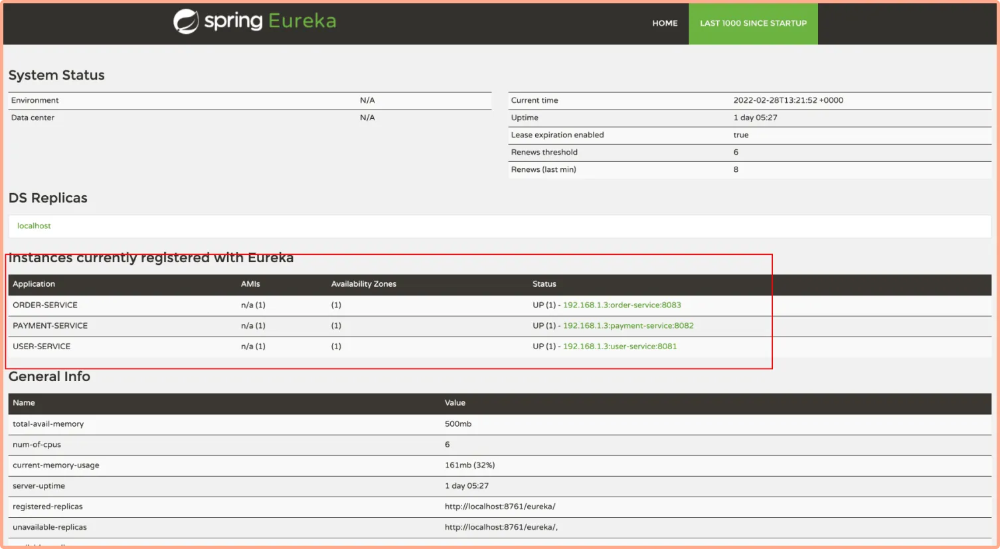

Running microservices on different ports using service registry

5. Confirm table creation
After running the services, check if the tables ```ORDERS``` and ```USERS``` are created using the commands below:

```
mysql> use signoz;
mysql> show tables;
```

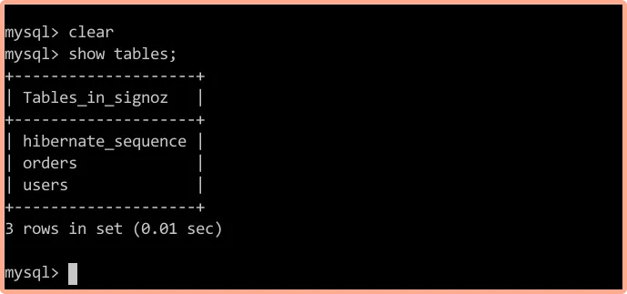

# Visualizing traces data with SigNoz dashboards​

To visualize the traces data with SigNoz, we first need to generate some user data by interacting with the spring boot application.

## Generating user data by interacting with the sample app​

You need to generate some user data to see how it appears in the SigNoz dashboard. The sample application comes with an UI to interact with the app. Use the below command in the root folder to launch the UI:

```
npm install -g serve
serve -l 5000 u
```

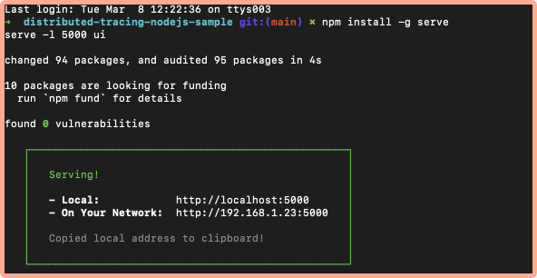

Use the buttons to interact with the app and generate some data. For example, click ```Create User``` button to create a new user in the MySQL db.

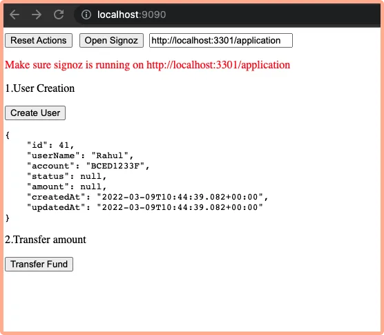

Now go to SigNoz dashboard, you will notice the list of service names that we configured:

- user-service
- order-service
- payment-service

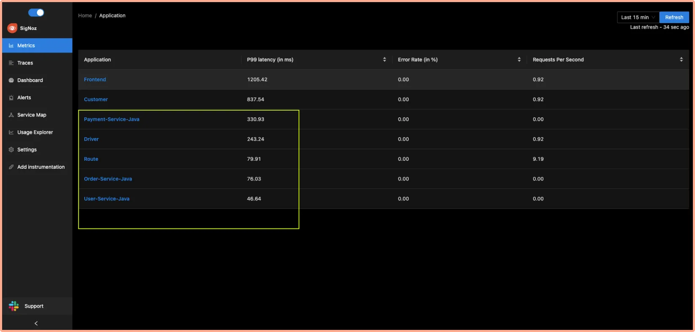

You can play around with the dashboard to see what data is captured. Below is a handy guide on how to use the SigNoz dashboard to see the captured data.

# How to use SigNoz dashboard to analyze traces​

The traces tab of the SigNoz dashboard provides powerful filters to analyze the traces data. You can use a number of filters to see traces data across many dimensions. For example:

1. See the count of requests by service and HTTP Status code

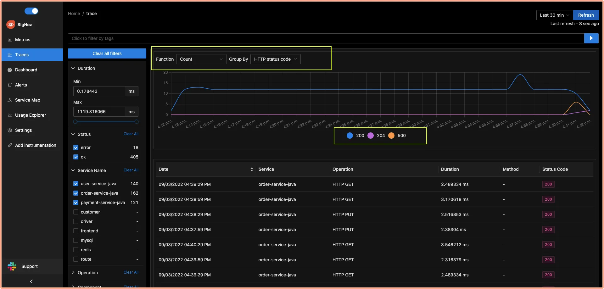

Use advanced filters to see count of requests by service and HTTP status code

2. Run aggregates on your tracing data

You can run aggregates like avg, max, min, 50th percentile, 90th percentile on your tracing data to get analyze performance issues in your application.

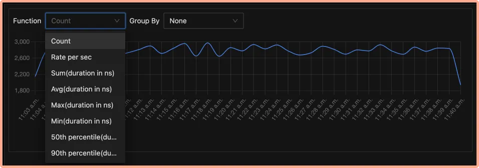

Run aggregates using the dropdown on your traces data quickly

3. Get more granular details by grouping traces data

You can also see these aggregates in more granular detail by grouping them by service name, operation, HTTP URL, HTTP method, etc.

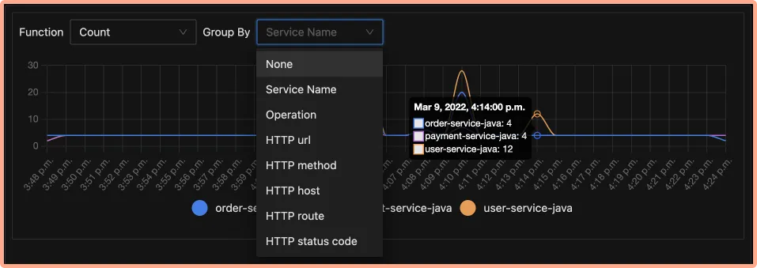

Group aggregates across a list of dimensions

4. Identify latency issues with Flamegraphs and Gantt charts

You can inspect each span in the table with Flamegraphs and Gantt charts to see a complete breakdown of the request. Establishing a sequential flow of the user request along with info on time taken by each part of the request can help identify latency issues quickly. Let’s see how it works in the case of our sample Spring Boot app.

Go to operation filter on the left navigation and apply two filters ```/payment/transfer/id/{id}/amount/{amount}``` and service name ```payment-service``` . Click on the single event listed in the table as shown below:

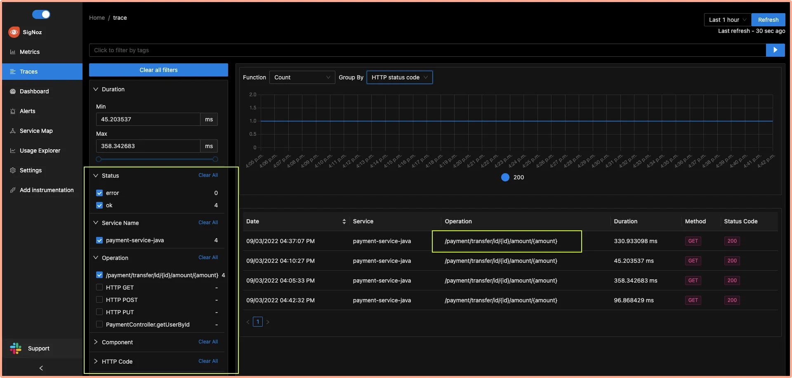

Use filters to inspect spans that you want to investigate further

You will be able to see the Flamegraph of the selected span which shows how the request traveled between the `payment-service` and the `user-service`. You can also use the Gantt chart to analyze each event in detail.

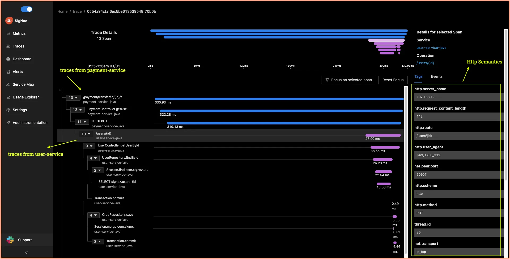

Flamegraph and Gantt chart for the selected event showing payment service traces with HTTP semantics

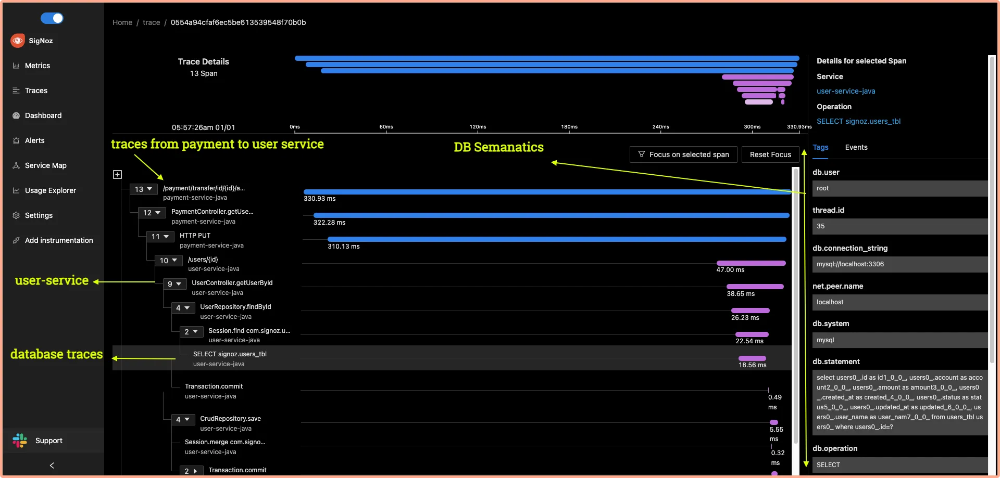

Databases traces which show semantics related to mysql db and query details

SigNoz also provides a detailed view of common [semantic conventions](https://github.com/open-telemetry/opentelemetry-specification/blob/main/specification/trace/semantic_conventions/http.md) like HTTP, network, and other attributes. The end-to-end tracing of user requests can help you to identify latency issues quickly.